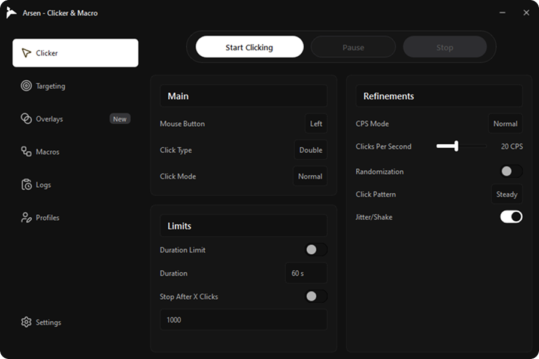
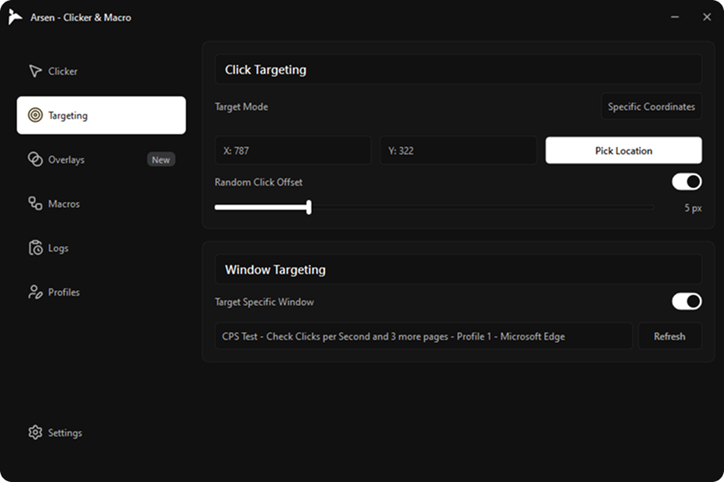
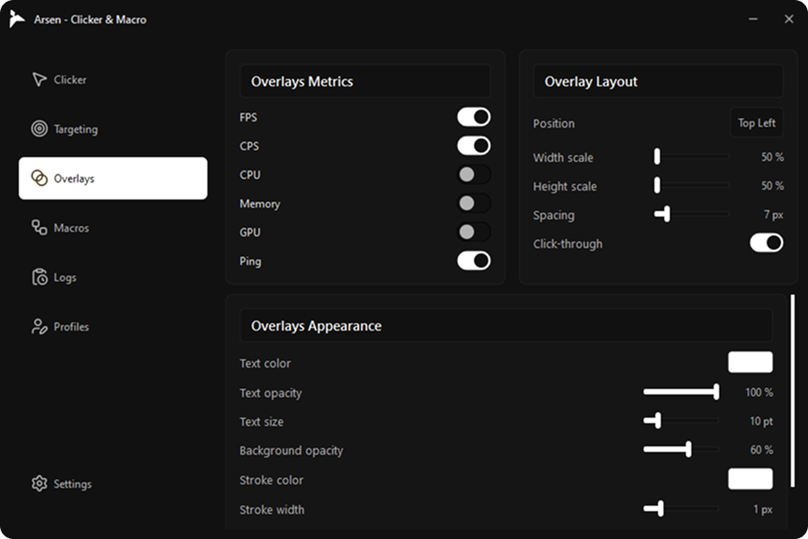
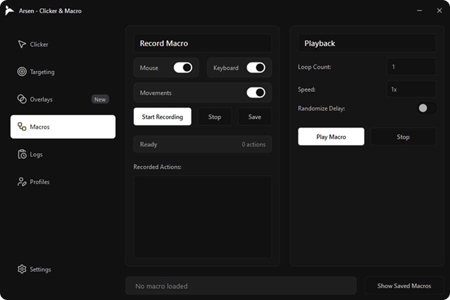
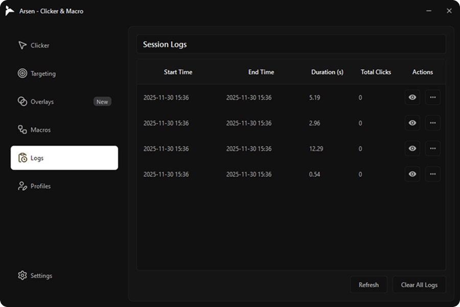
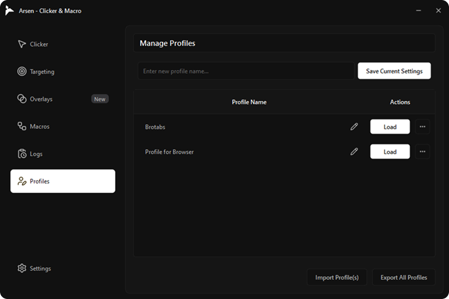
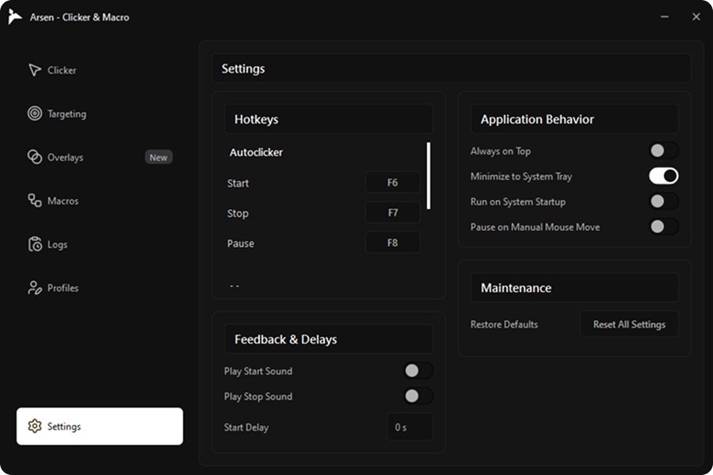

<h2 align="center"> ⚡ Arsen Clicker & Macro - v2.0.0 </h2>

  

  
  &nbsp;&nbsp;&nbsp;
  

  
  
  
  
  

Arsen v2.0.0 is finally here — fully redesigned, smoother, cleaner, faster, and more powerful.  
A modern autoclicker + macro application built with precision, performance, and a clean UI.

---

## 🎯 Features

- Ultra-responsive autoclicker  
- Macro recorder with advanced features  
- Clean and modern interface  
- Real-time hardware overlays  
- Profiles, logs, targeting, and custom keybindings  
- Smooth animations and minimal UI  
- Optimized for low-end PCs  

---

# 📸 Screenshots

### Interface Preview

  
  

  
  

  
  

  

---

## 📦 Download

Release page: **(add your link here)**  
Portable build.

---

## 🛠 Requirements

- Windows 10 or Windows 11
- No administrative privileges required

---

## 💬 Support

For issues, suggestions, or help, reach out through:

- GitHub Issues  
- Discord

---

## ⚖️ License

Creative Commons License.

